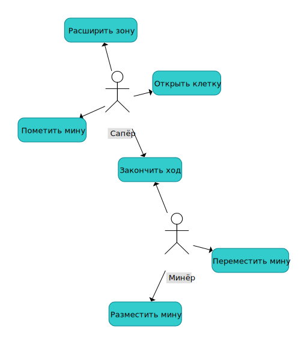

# Минер против сапера

## Идея
Игра представляет собой переосмысление известной компьютерной "Сапер", но с добавлением второго игрока - "Минера".

## Правила
До начала игры устанавливаются: размер поля, стартовая клетка, размер стартовой зоны сапера, количество клеток, на которое можно увеличить зону разминирования за один раз, количество мин, которое можно будет выставить или передвинуть за ход и количество мин, которое можно будет выставить до начала игры. После начала игры минер размещает заданное количество мин в стартовой зоне и передает ход саперу, который начинает свой ход нажатием на стартовую клетку. После открытия области сапер отмечает все найденные мины и передает ход минеру. В свой ход минер может поставить или передвинуть мины и закончить свой ход. Минер не обязан размещать или перемещать мины для завершения хода. Минер не может перемещать мины, уже отмеченные сапером, или выставлять мины на уже открытую область. Сапер в свой ход может открыть одну клетку в своей области, отметить сколько угодно мин и запросить расширение зоны.
Игра заканчивается победой сапера, если сапер разминировал все поставленные мины и таким образом занял все поле, или победой минера, если сапер подорвался на мине.

## Описание предметной области
Проект представляет собой асимметричную многопользовательскую игру в жанре стратегического противостояния, где два игрока берут на себя противоположные роли: минер скрытно расставляет мины на игровом поле, создавая ловушки, а сапер анализирует поле, пытаясь обезвредить все мины, избегая подрыва. Цель минера - заманить соперника в ловушку, используя хитрое расположение мин, а цель сапера - разгадать замысел оппонента, помечая мины флагами и открывая безопасные клетки. Игра сочетает элементы логики и тактического планирования, предлагая динамичное соревнование между созданием и разгадыванием опасных паттернов.

## Use-Case диаграмма

## ER-диаграмма
