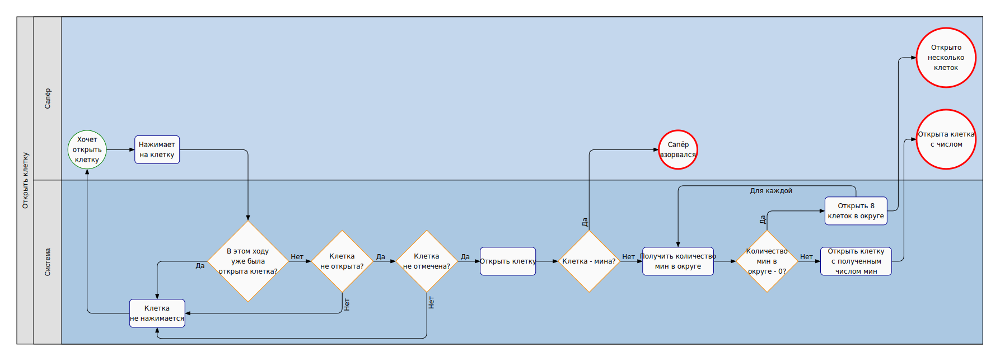

# Минёр против сапёра

## Идея
Игра представляет собой переосмысление известной компьютерной "сапёр", но с добавлением второго игрока - "минёра".

## Правила
До начала игры устанавливаются: размер поля, стартовая клетка, размер стартовой зоны сапёра, количество клеток, на которое можно увеличить зону разминирования за один раз, количество мин, которое можно будет выставить или передвинуть за ход и количество мин, которое можно будет выставить до начала игры. После начала игры минёр размещает заданное количество мин в стартовой зоне и передает ход сапёру, который начинает свой ход нажатием на стартовую клетку. После открытия области сапёр отмечает все найденные мины и передает ход минёру. В свой ход минёр может поставить или передвинуть мины и закончить свой ход. Минер не обязан размещать или перемещать мины для завершения хода. Минер не может перемещать мины, уже отмеченные сапёром, или выставлять мины на уже открытую область. сапёр в свой ход может открыть одну клетку в своей области, отметить сколько угодно мин и запросить расширение зоны.
Игра заканчивается победой сапёра, если сапёр разминировал все поставленные мины и таким образом занял все поле, или победой минёра, если сапёр подорвался на мине. Если сапёр занял все поле, но не смог отметить все мины на этом ходу, то сапёр проигрывает.

## Описание предметной области
Проект представляет собой асимметричную многопользовательскую игру в жанре стратегического противостояния, где два игрока берут на себя противоположные роли: минёр скрытно расставляет мины на игровом поле, создавая ловушки, а сапёр анализирует поле, пытаясь обезвредить все мины, избегая подрыва. Цель минёра - заманить соперника в ловушку, используя хитрое расположение мин, а цель сапёра - разгадать замысел оппонента, помечая мины флагами и открывая безопасные клетки. Игра сочетает элементы логики и тактического планирования, предлагая динамичное соревнование между созданием и разгадыванием опасных паттернов.

## Use-Case диаграмма

## ER-диаграмма

## User-flow для 

